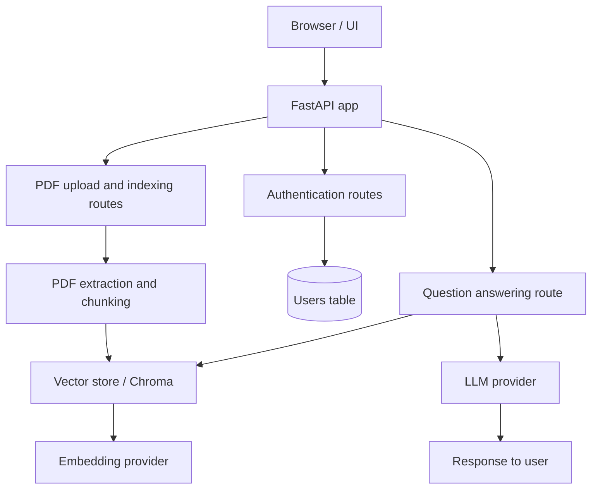

# Architecture

This project follows a simple layered architecture built around FastAPI, a relational database, and a vector database for retrieval-augmented generation.

## High-level architecture

## Components

### 1. Presentation layer

The UI is served from simple HTML templates in the `templates/` folder.

- `login.html` provides the login screen
- `dashboard.html` provides the main dashboard experience

These templates are returned by FastAPI endpoints in `app.py`.

### 2. API layer

The main application entry point is `app.py`.

It exposes endpoints for:

- user registration and login
- PDF upload and indexing
- question answering

The routes delegate work to the appropriate service modules rather than embedding business logic directly in the handlers.

### 3. Data layer

The database layer is built with:

- SQLAlchemy tables defined in `models.py`
- Async database access configured in `db.py`

The relational database stores:

- user accounts
- bot metadata such as `bot_id`, context, and temperature

### 4. Document processing layer

The document pipeline lives in `src/extract_text.py`.

It performs:

1. PDF parsing
2. OCR-based text extraction
3. Chunk creation for downstream indexing

### 5. Retrieval and generation layer

The retrieval and answer generation flow is handled by `src/rag.py`.

It uses:

- the embedding model from `src/model.py`
- the vector database (Chroma)
- the configured LLM provider

When a question is received, the system:

1. searches the vector store for relevant chunks
2. formats those chunks as context
3. sends the context and question to the LLM
4. returns the answer to the user

## Request flow

### User registration and login

1. The user submits credentials to `/register` or `/login`
2. The API checks the database for the username
3. Passwords are hashed before storage
4. The API returns a success or error response

### PDF ingestion flow

1. The user uploads a PDF through `/add_chunks`
2. The server validates that the file is a PDF
3. The PDF content is extracted and chunked
4. The chunks are added to the vector store with metadata including `bot_id`
5. Bot metadata is stored in the relational database

### Question answering flow

1. The client calls `/ask_question`
2. The app retrieves chunks using `bot_id` as a filter
3. The retrieved context is combined with the question
4. The LLM produces an answer based on that context

## Configuration model

The application uses `config.py` to read configuration from environment variables.

Key settings include:

- LLM provider and model
- Embedding provider and model
- Chroma credentials and database settings
- Database connection URL

## Design notes

- The architecture is intentionally simple and modular so each concern is isolated.
- The app uses a relational database for structured records and a vector database for semantic retrieval.
- Provider selection is abstracted in `src/model.py`, making it easier to switch between OpenAI, Ollama, Groq, Anthropic, or Gemini.
- The current implementation is optimized for a single-document ingestion and retrieval flow, but it can be expanded into a multi-user, multi-bot system.

## Extension opportunities

Future improvements could include:

- JWT or session-based authentication
- Per-user document storage and permissions
- Support for more document formats
- Better chunking and metadata strategies
- Observability, logging, and monitoring
- A more advanced frontend and admin dashboard
